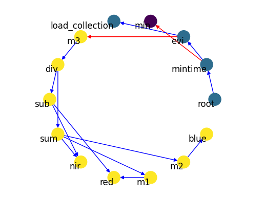

# OpenEO Process Graph Parser (Python & networkx)


[](https://codecov.io/github/Open-EO/openeo-pg-parser-networkx)

Python package to parse OpenEO process graphs from raw JSON into fully traversible [`networkx`](https://github.com/networkx/networkx) graph objects.
This package is an evolution of the [openeo-pg-parser-python](https://github.com/Open-EO/openeo-pg-parser-python) package.

## Installation
This package can be installed with pip:

```
pip install openeo-pg-parser-networkx
```

To enable plotting also install the `plot` extra:
```
pip install openeo-pg-parser-networkx[plot]
```

Currently Python versions 3.9-3.11 are supported.

## Basic usage
(An example notebook of using `openeo-pg-parser-networkx` together with a process implementation source like [`openeo-processes-dask`](https://github.com/Open-EO/openeo-processes-dask) can be found in `openeo-pg-parser-networkx/examples/01_minibackend_demo.ipynb`.)

**Parse a JSON OpenEO process graph:**

```
from openeo_pg_parser_networkx import OpenEOProcessGraph

EVI_GRAPH_PATH = "../tests/data/graphs/pg-evi-example.json"

parsed_graph = OpenEOProcessGraph.from_file(EVI_GRAPH_PATH)
```

```
> Deserialised process graph into nested structure
> Walking node root-7ecd43ed-b694-4a18-8805-eb366d277c8e
> Walking node mintime-7ecd43ed-b694-4a18-8805-eb366d277c8e
> Walking node min-80d5faba-c298-4d2f-82f5-be06ee417565
> Walking node evi-7ecd43ed-b694-4a18-8805-eb366d277c8e
> Walking node m3-657ee106-6571-4509-a1cf-59f212286011
> Walking node div-657ee106-6571-4509-a1cf-59f212286011
> Walking node sub-657ee106-6571-4509-a1cf-59f212286011
> Walking node nir-657ee106-6571-4509-a1cf-59f212286011
> Walking node red-657ee106-6571-4509-a1cf-59f212286011
> Walking node sum-657ee106-6571-4509-a1cf-59f212286011
> Walking node nir-657ee106-6571-4509-a1cf-59f212286011
> Walking node m1-657ee106-6571-4509-a1cf-59f212286011
> Walking node red-657ee106-6571-4509-a1cf-59f212286011
> Walking node m2-657ee106-6571-4509-a1cf-59f212286011
> Walking node blue-657ee106-6571-4509-a1cf-59f212286011
> Walking node load_collection-7ecd43ed-b694-4a18-8805-eb366d277c8e
```

**Plot it:**

```
parsed_graph.plot()
```



To execute a process graph, `OpenEOProcessGraph` needs to know which Python code to call for each of the nodes in the graph. This information is provided by a "process registry", which is basically a dictionary that maps each `process_id` to its actual Python implementation as a `Callable`.

**Register process implementations to a "process registry":**

The `ProcessRegistry` object also allows registering wrapper functions that will be wrapped around each registered process implementation.
See [openeo-processes-dask](https://github.com/Open-EO/openeo-processes-dask/blob/main/openeo_processes_dask/core.py) for an example of a wrapper function that resolves incoming parameters.

```
from openeo_pg_parser_networkx import ProcessRegistry

from openeo_processes_dask.process_implementations import apply, ndvi, multiply, load_collection, save_result
from openeo_processes_dask.core import process

# `process` is wrapped around each registered implementation
process_registry = ProcessRegistry(wrap_funcs=[process])

process_registry["apply"] =  apply
process_registry["ndvi"] =  ndvi
process_registry["multiply"] =  multiply
process_registry["load_collection"] =  load_collection
process_registry["save_result"] =  save_result


```
The `ProcessRegistry` also allows use of namespaces by using a tuple as a key instead of a single value. 
If using a single value the default namespace is "predefined".

Addressing entire namespaces can be done by using None as the value for process_id.

```
process_registry["namespace", "process_id"] = process
process_registry["namespace", None] = processes

```
This logic can be extended to all functionalities.

```
process = process_registry["namespace", "process_id"] # gets the single process named "process_id" in the namespace "namespace"
processes = process_registry["namespace", None] # gets the entire namespace "namespace"


del process_registry["namespace", "process_id"] # deletes the single process named "process_id" in the namespace "namespace"
del process_registry["namespace", None] # deletes the entire namespace "namespace"

```


**Build an executable callable from the process graph:**

```
pg_callable = parsed_graph.to_callable(process_registry=process_registry)
```

**Execute that callable like a normal Python function:**

```
pg_callable
```

```
> Running process load_collection
> Running process apply
> ...
```

## Development environment
`openeo-pg-parser-networkx` requires poetry `>1.2`, see their [docs](https://python-poetry.org/docs/#installation) for installation instructions.

To setup the python venv and install this project into it run:
```
poetry install
```

To add a new core dependency run:
```
poetry add some_new_dependency
```

To add a new development dependency run:
```
poetry add some_new_dependency --group dev
```

To run the test suite run:
```
poetry run python -m pytest
```

Note that you can also use the virtual environment that's generated by poetry as the kernel for the ipynb notebooks.

### Pre-commit hooks
This repo makes use of [pre-commit](https://pre-commit.com/) hooks to enforce linting & a few sanity checks.
In a fresh development setup, install the hooks using `poetry run pre-commit install`.
These will then automatically be checked against your changes before making the commit.
