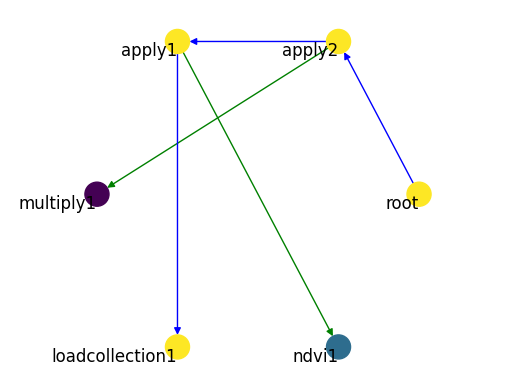

# OpenEO Process Graph Parser (Python & networkx)


[](https://codecov.io/github/Open-EO/openeo-pg-parser-networkx)

Python package to parse OpenEO process graphs from raw JSON into fully traversible [`networkx`](https://github.com/networkx/networkx) graph objects.
This package is an evolution of the [openeo-pg-parser-python](https://github.com/Open-EO/openeo-pg-parser-python) package.

## Installation
This package can be installed with pip:

```
pip install openeo-pg-parser-networkx
```

Currently Python versions 3.9 and 3.10 are supported.

## Basic usage
(An example notebook of using `openeo-pg-parser-networkx` together with a process implementation source like [`openeo-processes-dask`](https://github.com/Open-EO/openeo-processes-dask) can be found in `openeo-pg-parser-networkx/examples/01_minibackend_demo.ipynb`.)

**Parse a JSON OpenEO process graph:**

```
from openeo_pg_parser_networkx.graph import OpenEOProcessGraph

NDVI_GRAPH_PATH = "../tests/data/graphs/apply.json"

parsed_graph = OpenEOProcessGraph.from_file(NDVI_GRAPH_PATH)
```

```
> Deserialised process graph into nested structure
> Walking node root-fd8ae3b4-8cb8-46c8-a5cd-c8ee552d1945
> Walking node apply2-fd8ae3b4-8cb8-46c8-a5cd-c8ee552d1945
> Walking node multiply1-f8644201-32a8-4283-8814-a577c4e28226
> Walking node apply1-fd8ae3b4-8cb8-46c8-a5cd-c8ee552d1945
> Walking node ndvi1-06a8d8af-296a-4960-a1cb-06dcd251b6bb
> Walking node loadcollection1-fd8ae3b4-8cb8-46c8-a5cd-c8ee552d1945
```

**Plot it:**

```
parsed_graph.plot()
```



To execute a process graph, `OpenEOProcessGraph` needs to know which Python code to call for each of the nodes in the graph. This information is provided by a "process registry", which is basically a dictionary that maps each `process_id` to its actual Python implementation as a `Callable`.

**Register process implementations to a "process registry":**

```
from openeo_pg_parser_networkx import ProcessRegistry
process_registry = ProcessRegistry()

from openeo_processes_dask.process_implementations import apply, ndvi, multiply, load_collection, save_result

process_registry["apply"] =  apply
process_registry["ndvi"] =  ndvi
process_registry["multiply"] =  multiply
process_registry["load_collection"] =  load_collection
process_registry["save_result"] =  save_result
```

**Build an executable callable from the process graph:**

```
pg_callable = parsed_graph.to_callable(process_registry=process_registry)
```

**Execute that callable like a normal Python function:**

```
pg_callable
```

```
> Running process load_collection
> Running process apply
> ...
```

## Development environment
`openeo-pg-parser-networkx` requires poetry `>1.2`, see their [docs](https://python-poetry.org/docs/#installation) for installation instructions.

To setup the python venv and install this project into it run:
```
poetry install
```

To add a new core dependency run:
```
poetry add some_new_dependency
```

To add a new development dependency run:
```
poetry add some_new_dependency --group dev
```

To run the test suite run:
```
poetry run python -m pytest
```

Note that you can also use the virtual environment that's generated by poetry as the kernel for the ipynb notebooks.

### Pre-commit hooks
This repo makes use of [pre-commit](https://pre-commit.com/) hooks to enforce linting & a few sanity checks.
In a fresh development setup, install the hooks using `poetry run pre-commit install`.
These will then automatically be checked against your changes before making the commit.
